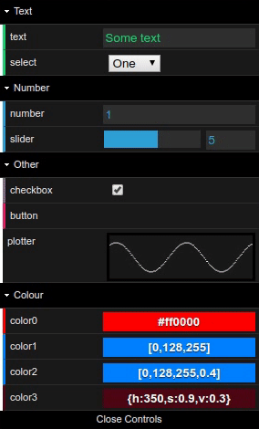

# Fork

This is a fork of dat.gui where I merged some outstanding pull request to fix bugs.
Also includes @MacroMan's fork with extra features - v1.2.0+dataarts-0.7.6


# dat.GUI

A lightweight graphical user interface for changing variables in JavaScript.

Get started with dat.GUI by reading the [tutorial](http://workshop.chromeexperiments.com/examples/gui)
or the [API documentation](API.md).


## MacroMan's extra features
* Added hide/show methods to all Controllers ([#93](https://github.com/dataarts/dat.gui/issues/93)).
* Delete button added to preset menu ([#215](https://github.com/dataarts/dat.gui/issues/215)).
* Pass passive option to most event listeners to improve scroll performance ([#193](https://github.com/dataarts/dat.gui/issues/193)).
* Added forceUpdateDisplay to listen(). Allows overiding of the active check on GUI inputs before updating ([#212](https://github.com/dataarts/dat.gui/issues/212)).
* Fixed left border color not working on non-hex color controllers ([#208](https://github.com/dataarts/dat.gui/issues/208))
* Added value plotter controller ([#191](https://github.com/dataarts/dat.gui/issues/191))
* Implemented number box changes on keyboard arrow up/down, mouse wheel scroll and converted inputs to number. ([#195](https://github.com/dataarts/dat.gui/issues/195))



See [API.md](API.md) for usage


## Packaged Builds
The easiest way to use dat.GUI in your code is by using the built source at [`build/dat.gui.min.js`](build/dat.gui.min.js). This built JavaScript file bundles all the necessary dependencies to run dat.GUI.

In your `head` tag, include the following code:
```html
<script type="text/javascript" src="dat.gui.min.js"></script>
```

## Example code
See `tests/manual.html` for an example of each type of controller.

## Installing from npm

```bash
$ npm install --save @macroman/dat.gui
```

```js
// CommonJS:
const dat = require('dat.gui');

// ES6:
import * as dat from 'dat.gui';

const gui = new dat.GUI();
```

## Directory Contents

```
├── build - Compiled source code.
├── src - Source files.
└── tests - Tests.
```

## Building your own dat.GUI

In the terminal, enter the following:

```
$ npm install
$ npm run build
```

## Running tests

In the terminal, enter `npm run dev` and open http://localhost:8080/tests/

* Open `qunit.html` to run automated unit tests
* Open `manual.html` for a manual test suite - events are logged to the browser console.


## npm scripts

* npm run dev - Build development version of script and watch for changes.
* npm run build - Build development and production version of scripts.
* npm run build-docs - Automatically generate API.md from source code
* npm run lint - Run eslint on all code


## Working with Content Security Policy
If you're using a server with a Content Security Policy in place that blocks 'unsafe-inline', you will have problems when dat.gui.js tries to inject style information. To get around this, load 'build/dat.gui.css' as an external style sheet.

## Changes
View the [Change Log](CHANGELOG.md)

## Thanks
The following libraries / open-source projects were used in the development of dat.GUI:
 * [Rollup](https://rollupjs.org)
 * [Sass](http://sass-lang.com/)
 * [Node.js](http://nodejs.org/)
 * [QUnit](https://github.com/jquery/qunit) / [jquery](http://jquery.com/)
 * [stats.js](http://mrdoob.github.io/stats.js/)
